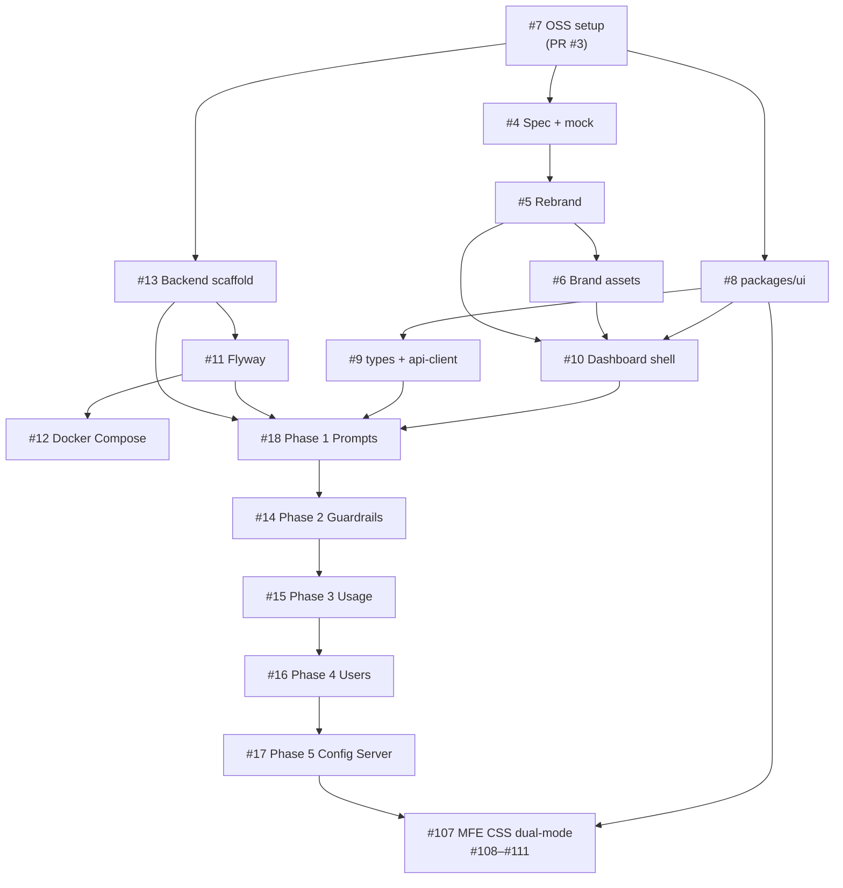

# AIPlane — Issue, Branch & PR Workflow

This document describes how to implement the open-source roadmap for **AIPlane** using GitHub Issues, feature branches, and pull requests. It is aligned with [`docs/SPEC.md`](SPEC.md), the UI mock at [`mock/aiplane_dashboard_mockup.html`](../mock/aiplane_dashboard_mockup.html), and brand assets in [`mock/icons/`](../mock/icons/).

> **Branding:** The product name is **AIPlane** (not "AI Manager"). The mock HTML still shows the old name in places — update it as part of issue #5.

---

## Issue tracker overview

| Issue | Title | Branch | Phase | Status |
|-------|-------|--------|-------|--------|
| [#7](https://github.com/madmmas/aiplane/issues/7) | OSS standard setup (license, CI, community docs) | `chore/oss-standard-setup` | Foundation | Done ([#3](https://github.com/madmmas/aiplane/pull/3)) |
| [#4](https://github.com/madmmas/aiplane/issues/4) | Add product spec and UI mock reference materials | `docs/add-spec-and-mock` | Foundation | Done ([#30](https://github.com/madmmas/aiplane/pull/30)) |
| [#5](https://github.com/madmmas/aiplane/issues/5) | Rebrand AI Manager → AIPlane | `chore/rebrand-aiplane` | Foundation | Done ([#32](https://github.com/madmmas/aiplane/pull/32)) |
| [#6](https://github.com/madmmas/aiplane/issues/6) | Add AIPlane brand assets from mock/icons | `feat/dashboard-brand-assets` | Foundation | Done ([#34](https://github.com/madmmas/aiplane/pull/34)) |
| [#8](https://github.com/madmmas/aiplane/issues/8) | Scaffold `packages/ui` design system | `feat/packages-ui-tokens` | Phase 0 | Done ([#40](https://github.com/madmmas/aiplane/pull/40)) |
| [#9](https://github.com/madmmas/aiplane/issues/9) | Add shared types and API client packages | `feat/packages-types-api-client` | Phase 0 | Done ([#41](https://github.com/madmmas/aiplane/pull/41)) |
| [#10](https://github.com/madmmas/aiplane/issues/10) | Dashboard host shell from UI mock | `feat/dashboard-host-shell` | Phase 0 | Done ([#42](https://github.com/madmmas/aiplane/pull/42)) |
| [#13](https://github.com/madmmas/aiplane/issues/13) | Backend Spring Boot Maven scaffold | `feat/backend-scaffold` | Phase 0 | Done ([#43](https://github.com/madmmas/aiplane/pull/43)) |
| [#11](https://github.com/madmmas/aiplane/issues/11) | Flyway migrations V1–V9 | `feat/flyway-migrations` | Phase 0 | Done ([#44](https://github.com/madmmas/aiplane/pull/44)) |
| [#12](https://github.com/madmmas/aiplane/issues/12) | Docker Compose dev environment | `feat/docker-compose-dev` | Phase 0 | Done ([#45](https://github.com/madmmas/aiplane/pull/45)) |
| [#47](https://github.com/madmmas/aiplane/issues/47) | Frontend Vitest + RTL setup | `chore/frontend-testing-setup` | Hygiene | Done ([#68](https://github.com/madmmas/aiplane/pull/68)) |
| [#48](https://github.com/madmmas/aiplane/issues/48) | Backend JUnit/Testcontainers/JaCoCo setup | `chore/backend-testing-setup` | Hygiene | Done ([#69](https://github.com/madmmas/aiplane/pull/69)) |
| [#49](https://github.com/madmmas/aiplane/issues/49) | Wire test execution + coverage into CI | `chore/ci-test-execution` | Hygiene | Done ([#72](https://github.com/madmmas/aiplane/pull/72)) |
| [#70](https://github.com/madmmas/aiplane/issues/70) | Add CODEOWNERS and CHANGELOG.md | `docs/codeowners-and-changelog` | Hygiene | Done ([#73](https://github.com/madmmas/aiplane/pull/73)) |
| [#71](https://github.com/madmmas/aiplane/issues/71) | Add DEVLOG for engineering decisions | `docs/add-devlog` | Hygiene | Done ([#74](https://github.com/madmmas/aiplane/pull/74)) |
| [#18](https://github.com/madmmas/aiplane/issues/18) | Phase 1 — Prompt Manager MVP | `feat/phase-1-prompt-manager-mvp` | Phase 1 | Done (via [#79](https://github.com/madmmas/aiplane/pull/79)–[#82](https://github.com/madmmas/aiplane/pull/82)) |
| [#50](https://github.com/madmmas/aiplane/issues/50) | Prompt CRUD REST API (Spring Data JPA) | `feat/phase-1-prompt-crud` | Phase 1 | Done ([#79](https://github.com/madmmas/aiplane/pull/79)) |
| [#51](https://github.com/madmmas/aiplane/issues/51) | Version promotion flow + export hook | `feat/phase-1-version-promotion` | Phase 1 | Done ([#80](https://github.com/madmmas/aiplane/pull/80)) |
| [#52](https://github.com/madmmas/aiplane/issues/52) | Playground endpoint (Spring AI — Anthropic + OpenAI) | `feat/phase-1-playground-endpoint` | Phase 1 | Done ([#81](https://github.com/madmmas/aiplane/pull/81)) |
| [#53](https://github.com/madmmas/aiplane/issues/53) | Prompt library, timeline, editor, playground UI | `feat/phase-1-prompt-manager-ui` | Phase 1 | Done ([#82](https://github.com/madmmas/aiplane/pull/82)) |
| [#14](https://github.com/madmmas/aiplane/issues/14) | Phase 2 — Guardrail MVP | `feat/phase-2-guardrail` | Phase 2 | Done (via [#75](https://github.com/madmmas/aiplane/pull/75)–[#77](https://github.com/madmmas/aiplane/pull/77)) |
| [#54](https://github.com/madmmas/aiplane/issues/54) | Core evaluators (keyword / regex / max-length) | `feat/phase-2-guardrail-evaluators` | Phase 2 | Done ([#75](https://github.com/madmmas/aiplane/pull/75)) |
| [#55](https://github.com/madmmas/aiplane/issues/55) | Guardrail sets with ordering + short-circuit | `feat/phase-2-guardrail-sets` | Phase 2 | Done ([#76](https://github.com/madmmas/aiplane/pull/76)) |
| [#56](https://github.com/madmmas/aiplane/issues/56) | Rule builder + test panel UI | `feat/phase-2-guardrail-ui` | Phase 2 | Done ([#77](https://github.com/madmmas/aiplane/pull/77)) |
| [#15](https://github.com/madmmas/aiplane/issues/15) | Phase 3 — Usage Telemetry | `feat/phase-3-usages-data` | Phase 3 | Done (via [#84](https://github.com/madmmas/aiplane/pull/84)–[#86](https://github.com/madmmas/aiplane/pull/86)) |
| [#57](https://github.com/madmmas/aiplane/issues/57) | Usage event ingest endpoint | `feat/phase-3-usage-ingest` | Phase 3 | Done ([#84](https://github.com/madmmas/aiplane/pull/84)) |
| [#58](https://github.com/madmmas/aiplane/issues/58) | Cost tracking with provider rate config | `feat/phase-3-cost-tracking` | Phase 3 | Done ([#85](https://github.com/madmmas/aiplane/pull/85)) |
| [#59](https://github.com/madmmas/aiplane/issues/59) | Usage overview dashboard UI | `feat/phase-3-usage-dashboard` | Phase 3 | Done ([#86](https://github.com/madmmas/aiplane/pull/86)) |
| [#16](https://github.com/madmmas/aiplane/issues/16) | Phase 4 — User Management + API Keys | `feat/phase-4-user-manager` | Phase 4 | Done (via [#88](https://github.com/madmmas/aiplane/pull/88)–[#91](https://github.com/madmmas/aiplane/pull/91)) |
| [#60](https://github.com/madmmas/aiplane/issues/60) | Invite flow + JWT auth | `feat/phase-4-invite-jwt-auth` | Phase 4 | Done ([#88](https://github.com/madmmas/aiplane/pull/88)) |
| [#61](https://github.com/madmmas/aiplane/issues/61) | API key CRUD + ApiKeyAuthenticationFilter | `feat/phase-4-api-keys` | Phase 4 | Done ([#90](https://github.com/madmmas/aiplane/pull/90)) |
| [#62](https://github.com/madmmas/aiplane/issues/62) | User + API key management UI | `feat/phase-4-user-manager-ui` | Phase 4 | Done ([#91](https://github.com/madmmas/aiplane/pull/91)) |
| [#17](https://github.com/madmmas/aiplane/issues/17) | Phase 5 — Config Server Integration | `feat/phase-5-config-server` | Phase 5 | Done (via [#93](https://github.com/madmmas/aiplane/pull/93)–[#96](https://github.com/madmmas/aiplane/pull/96)) |
| [#63](https://github.com/madmmas/aiplane/issues/63) | JDBC backend for Config Server | `feat/phase-5-config-server-jdbc` | Phase 5 | Done ([#93](https://github.com/madmmas/aiplane/pull/93)) |
| [#64](https://github.com/madmmas/aiplane/issues/64) | PromptConfigExporter on version promotion | `feat/phase-5-prompt-config-exporter` | Phase 5 | Done ([#94](https://github.com/madmmas/aiplane/pull/94)) |
| [#65](https://github.com/madmmas/aiplane/issues/65) | Refresh endpoint proxied via API Server | `feat/phase-5-refresh-endpoint` | Phase 5 | Done ([#95](https://github.com/madmmas/aiplane/pull/95)) |
| [#66](https://github.com/madmmas/aiplane/issues/66) | News Radar demo consuming Config Server | `feat/phase-5-news-radar-demo` | Phase 5 | Done ([#96](https://github.com/madmmas/aiplane/pull/96)) |
| [#107](https://github.com/madmmas/aiplane/issues/107) | Wire CSS/Tailwind so remotes work standalone and federated | `fix/mfe-standalone-and-federated-css` | Hygiene | Done (CSS via [#108](https://github.com/madmmas/aiplane/issues/108)–[#111](https://github.com/madmmas/aiplane/issues/111); host remoteEntry orchestration in this epic) |
| [#108](https://github.com/madmmas/aiplane/issues/108) | prompt-manager standalone + federated CSS/Tailwind | `fix/prompt-manager-standalone-federated-css` | Hygiene | Done |
| [#109](https://github.com/madmmas/aiplane/issues/109) | guardrail standalone + federated CSS/Tailwind | `fix/guardrail-standalone-federated-css` | Hygiene | Done |
| [#110](https://github.com/madmmas/aiplane/issues/110) | user-manager standalone + federated CSS/Tailwind | `fix/user-manager-standalone-federated-css` | Hygiene | Done |
| [#111](https://github.com/madmmas/aiplane/issues/111) | usages-data standalone + federated CSS/Tailwind | `fix/usages-data-standalone-federated-css` | Hygiene | Done |
| [#100](https://github.com/madmmas/aiplane/issues/100) | Microservices Migration (Strangler Fig) | — | Microservices | Open (via [#101](https://github.com/madmmas/aiplane/issues/101)–[#104](https://github.com/madmmas/aiplane/issues/104), [#127](https://github.com/madmmas/aiplane/issues/127)–[#130](https://github.com/madmmas/aiplane/issues/130)) |
| [#101](https://github.com/madmmas/aiplane/issues/101) | Phase 0 — Gateway + observability baseline | `feat/phase-0-gateway-observability` | Microservices | Open |
| [#102](https://github.com/madmmas/aiplane/issues/102) | Phase 1 — Extract guardrail-service | `feat/phase-1-guardrail-service` | Microservices | Open |
| [#103](https://github.com/madmmas/aiplane/issues/103) | Phase 2 — Extract usage-service | `feat/phase-2-usage-service` | Microservices | Open |
| [#104](https://github.com/madmmas/aiplane/issues/104) | Phase 2.5 — graphql-bff aggregation | `feat/phase-2.5-graphql-bff` | Microservices | Open |
| [#127](https://github.com/madmmas/aiplane/issues/127) | Phase 3 — Extract prompt-manager-service | `feat/phase-3-prompt-manager-service` | Microservices | Open |
| [#128](https://github.com/madmmas/aiplane/issues/128) | Phase 4 — Extract user-management-service | `feat/phase-4-user-management-service` | Microservices | Open |
| [#129](https://github.com/madmmas/aiplane/issues/129) | Phase 5 — Extract authentication-service | `feat/phase-5-authentication-service` | Microservices | Open |
| [#130](https://github.com/madmmas/aiplane/issues/130) | Phase 6 — Decommission legacy api-server | `chore/phase-6-decommission-api-server` | Microservices | Open |

**Phase 0–5 complete** (#8–#13 foundation, #50–#53, #54–#56, #57–#59, #60–#62, #63–#66). **MFE CSS dual-mode complete** (#107 via #108–#111). **Next:** microservices Strangler Fig extraction (#100) — gateway → guardrail → usage → graphql-bff → prompt → user → auth → decommission (`docs/MICROSERVICES_PLAN.md`). Also available: Phase 6 Advanced (PII / LLM-judge guardrails, playground compare, CSV export, CI prompt deploy), or host shell work to wire real cookie auth + live API (dashboard still defaults to `useMocks: true`).

---

## Recommended merge order



**Parallel tracks after #7 merges:**

- **Docs track:** #4 → #5 → #6
- **Frontend track:** #8 → #9 → #10 (can start #8 in parallel with docs)
- **Backend track:** #13 → #11 → #12 (independent of frontend until Phase 1)
- **MFE CSS hygiene (current):** #107 parent → #108 / #109 / #110 / #111 in parallel (shared CSS strategy; one PR per remote preferred)

---

## Standard workflow (every issue)

Use this checklist for **each issue**. One issue = one branch = one PR.

### 1. Prepare

```bash
git checkout main
git pull origin main
```

### 2. Create branch

Branch names are listed in the issue table above. Pattern:

```
<type>/<short-description>
```

Examples: `docs/add-spec-and-mock`, `feat/dashboard-host-shell`, `feat/phase-1-prompt-manager-mvp`

```bash
git checkout -b docs/add-spec-and-mock   # replace with your issue branch
```

### 3. Implement

- Read the linked issue acceptance criteria
- Reference `docs/SPEC.md` for architecture details
- Reference `mock/aiplane_dashboard_mockup.html` for layout/UX targets
- Use icons from `mock/icons/` (copy into `apps/dashboard/public/` when needed)

**Quality checks before commit:**

```bash
pnpm lint
pnpm typecheck
pnpm build
```

For backend issues (Java):

```bash
cd backend && ./mvnw verify
```

### 4. Commit

Use [Conventional Commits](https://www.conventionalcommits.org/) with the issue number:

```bash
git add <files>
git commit -m "docs: add SPEC and UI mock reference (#4)"
```

Prefix guide:

| Prefix | Use for |
|--------|---------|
| `docs:` | Documentation, SPEC, mock files |
| `chore:` | Tooling, rebrand, OSS setup |
| `feat:` | New features |
| `fix:` | Bug fixes |

### 5. Push and open PR

```bash
git push -u origin HEAD
gh pr create \
  --title "docs: add SPEC and UI mock reference (#4)" \
  --body "$(cat <<'EOF'
## Summary

- Adds `docs/SPEC.md` and `mock/` reference materials
- Links SPEC from README

Closes #4

## Test plan

- [ ] `pnpm lint` passes
- [ ] `pnpm typecheck` passes
- [ ] `pnpm build` passes
- [ ] README links resolve on GitHub

EOF
)"
```

> Use `Closes #N` in the PR body to auto-close the issue when merged.

### 6. Review and merge

- Wait for CI (`ci` check) to pass
- Squash-merge into `main` (repo setting)
- Delete the branch after merge

### 7. Branch protection on `main` (required for #7)

**Status:** enabled on `madmmas/aiplane`. `main` requires the GitHub Actions job named `ci`
(lint → typecheck → test → build), enforces rules for administrators, and disallows
force-pushes. Local Husky also rejects direct commits to `main`/`master`. The separate
`backend` job runs `mvn verify` (Surefire + Failsafe Testcontainers + JaCoCo) and uploads
coverage artifacts; keep it green even when it is not a required check.

To verify or re-apply:

```bash
# Verify
gh api repos/madmmas/aiplane/branches/main/protection \
  --jq '{checks: .required_status_checks.checks, enforce_admins: .enforce_admins.enabled}'

# Re-apply (maintainers only)
gh api -X PUT repos/madmmas/aiplane/branches/main/protection --input - <<'EOF'
{
  "required_status_checks": {
    "strict": true,
    "contexts": ["ci"]
  },
  "enforce_admins": true,
  "required_pull_request_reviews": null,
  "restrictions": null
}
EOF
```

---

## Per-issue quick start

### #7 — OSS standard setup

**Status:** complete via [PR #3](https://github.com/madmmas/aiplane/pull/3) (license, community docs, Biome/Husky, CI, templates, Dependabot) plus branch protection + Husky main-branch guard.

Acceptance checklist:

- [x] `LICENSE` (MIT), `CONTRIBUTING.md`, `CODE_OF_CONDUCT.md`, `SECURITY.md`
- [x] Biome + Husky + lint-staged at repo root
- [x] CI workflow: lint → typecheck → build (job id `ci`)
- [x] Issue templates + PR template + Dependabot
- [x] README badges and OSS sections
- [x] Branch protection requires `ci` on `main`

---

### #4 — Add spec and mock

```bash
git checkout main && git pull
git checkout -b docs/add-spec-and-mock

# Stage reference materials (exclude mock/files 2/ duplicates)
git add docs/SPEC.md mock/aiplane_dashboard_mockup.html mock/icons/
git add README.md

git commit -m "docs: add product spec and UI mock reference (#4)"
git push -u origin docs/add-spec-and-mock
gh pr create --title "docs: add product spec and UI mock reference (#4)" --body "Closes #4"
```

---

### #5 — Rebrand to AIPlane

```bash
git checkout -b chore/rebrand-aiplane

# Find remaining references
rg -i "ai manager|ai-manager" --glob '!node_modules' --glob '!dist'

git commit -am "chore: rebrand AI Manager to AIPlane (#5)"
git push -u origin chore/rebrand-aiplane
gh pr create --title "chore: rebrand AI Manager to AIPlane (#5)" --body "Closes #5"
```

---

### #6 — Brand assets

```bash
git checkout -b feat/dashboard-brand-assets

cp mock/icons/*.svg apps/dashboard/public/
# Wire favicon + logos in index.html and shell components

git commit -m "feat(dashboard): add AIPlane brand assets from mock (#6)"
git push -u origin feat/dashboard-brand-assets
gh pr create --title "feat(dashboard): add AIPlane brand assets (#6)" --body "Closes #6"
```

---

### #8 — packages/ui

```bash
git checkout -b feat/packages-ui-tokens

mkdir -p packages/ui/src
# See SPEC §6 and §12 for token values and Tailwind config

git commit -m "feat(ui): scaffold packages/ui design tokens (#8)"
git push -u origin feat/packages-ui-tokens
gh pr create --title "feat(ui): scaffold packages/ui design tokens (#8)" --body "Closes #8"
```

---

### #9 — packages/types + api-client

```bash
git checkout -b feat/packages-types-api-client

mkdir -p packages/types/src packages/api-client/src

git commit -m "feat(packages): add shared types and API client (#9)"
git push -u origin feat/packages-types-api-client
gh pr create --title "feat(packages): add shared types and API client (#9)" --body "Closes #9"
```

---

### #10 — Dashboard host shell

```bash
git checkout -b feat/dashboard-host-shell

# Implement layout matching mock/aiplane_dashboard_mockup.html:
# - Topbar: logo, project switcher, search/settings/avatar
# - Sidebar: Manage (Prompts, Guardrails, Users, Usage) + Config section
# - Remote MFE loading via Module Federation

git commit -m "feat(dashboard): implement host shell from UI mock (#10)"
git push -u origin feat/dashboard-host-shell
gh pr create --title "feat(dashboard): implement host shell from UI mock (#10)" --body "Closes #10"
```

**Mock reference — navigation items:**

| Section | Item | Mock icon class |
|---------|------|-----------------|
| Manage | Prompts | `ti-messages` |
| Manage | Guardrails | `ti-shield-check` |
| Manage | Users | `ti-users` |
| Manage | Usage | `ti-chart-bar` |
| Config | Providers | `ti-plug` |
| Config | API Keys | `ti-key` |

Use **Tabler Icons React** in implementation (SPEC §12), not the mock's CDN `<i class="ti ...">` tags.

---

### #13 — Backend scaffold

```bash
git checkout -b feat/backend-scaffold

mkdir -p backend/config-server backend/api-server
# Maven parent POM + two modules per SPEC §3

git commit -m "feat(backend): scaffold Spring Boot modular monolith (#13)"
git push -u origin feat/backend-scaffold
gh pr create --title "feat(backend): scaffold Spring Boot modular monolith (#13)" --body "Closes #13"
```

---

### #11 — Flyway migrations

```bash
git checkout -b feat/flyway-migrations
# Requires #13 merged first

git commit -m "feat(db): add Flyway migrations V1-V9 (#11)"
git push -u origin feat/flyway-migrations
gh pr create --title "feat(db): add Flyway migrations V1-V9 (#11)" --body "Closes #11"
```

---

### #12 — Docker Compose

```bash
git checkout -b feat/docker-compose-dev
# Requires #13 and preferably #11 merged

git commit -m "feat(infra): add Docker Compose dev environment (#12)"
git push -u origin feat/docker-compose-dev
gh pr create --title "feat(infra): add Docker Compose dev environment (#12)" --body "Closes #12"
```

---

### Phase 1–5 (#18, #14–#17)

Follow the same branch → commit → PR pattern. Each phase epic maps to SPEC §10 roadmap items. Do not start a phase until its dependencies (Phase 0 foundation + prior phases) are merged.

---

## Mock and icon assets

| Asset | Path | Usage |
|-------|------|-------|
| Full UI mock | `mock/aiplane_dashboard_mockup.html` | Layout, components, colour tokens reference |
| Favicon | `mock/icons/aiplane-favicon.svg` | Browser tab icon |
| App icon | `mock/icons/aiplane-icon.svg` | Collapsed sidebar |
| Logo (dark bg) | `mock/icons/aiplane-logo-dark.svg` | Dark theme topbar/sidebar |
| Logo (light bg) | `mock/icons/aiplane-logo-light.svg` | Light theme topbar/sidebar |

The `mock/` directory is excluded from Biome lint (`biome.json`). It is **reference-only** — not served in production. Production assets live in `apps/dashboard/public/`.

---

## Repository layout (target)

From SPEC §2 — where each issue contributes:

```
aiplane/
├── apps/                    # MFE apps (#10, Phase 1–5)
├── packages/
│   ├── ui/                  # #8
│   ├── types/               # #9
│   └── api-client/          # #9
├── backend/                 # #13, #11
├── docs/
│   ├── SPEC.md              # #4
│   └── ISSUE_WORKFLOW.md    # this file
├── mock/                    # #4 (reference)
├── .github/                 # #7
├── docker-compose.yml       # #12
└── LICENSE                  # #7
```

---

## Tips

- **One PR per issue** keeps reviews small and CI fast
- **Phases 0–5 are merged** — foundation through Config Server; MFE CSS dual-mode (#107–#111) is done; next backend track is microservices extraction (#100 / #101–#104, #127–#130)
- **Do not commit `mock/files 2/`** — duplicate copies; use `mock/icons/` only
- **Keep dashboard UI work scoped** — host shell (#10) is separate from domain MFEs (prompt/guardrail/usage/users)
- **Each remote must work two ways** — standalone on its Vite port and federated in the dashboard; CSS wiring is tracked in #107–#111
- Link PRs to issues with `Closes #N` for automatic cleanup
- Assign yourself on GitHub before starting: `gh issue edit N --add-assignee @me`

---

## Getting help

- Architecture questions → [`docs/SPEC.md`](SPEC.md)
- Contribution guidelines → [`CONTRIBUTING.md`](../CONTRIBUTING.md)
- Bug reports → [GitHub Issues](https://github.com/madmmas/aiplane/issues/new?template=bug_report.yml)
- Feature requests → [GitHub Issues](https://github.com/madmmas/aiplane/issues/new?template=feature_request.yml)
